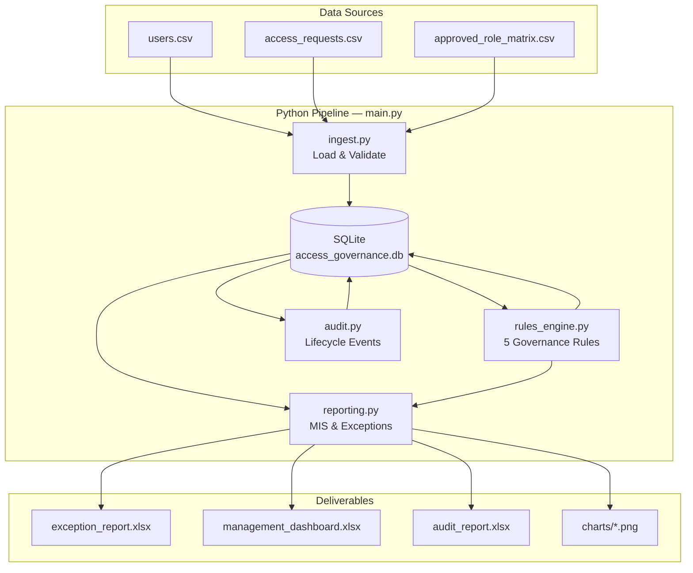

# System Access Governance & MIS Reporting Tool

Production-style Python platform simulating a bank's **System Access Governance** environment — aligned with Group Access Management, Operational Risk, Governance & Controls, and MIS Reporting functions (e.g., UBS Reporting & Analytics / RAS).

## Overview

This tool automates the full access governance lifecycle:

- **User Access Repository** — employee profiles with department, role, and manager hierarchy
- **Approved Access Matrix** — role-based system entitlements (RBAC)
- **Access Request Tracking** — approved, rejected, and pending requests
- **Governance Rules Engine** — automated control checks with severity classification
- **Audit Logging** — immutable trail of access lifecycle events
- **MIS Dashboard** — Excel management reports with embedded charts

## Tech Stack

| Layer | Technology |
|-------|------------|
| Language | Python 3.12 |
| Data Processing | Pandas |
| ORM / Database | SQLAlchemy, SQLite |
| Excel Reporting | OpenPyXL |
| Charts | OpenPyXL (embedded), Matplotlib (PNG exports) |

## Project Structure

```text
project/
├── data/
│   ├── users.csv
│   ├── access_requests.csv
│   └── approved_role_matrix.csv
├── database/
│   └── access_governance.db          # Generated at runtime
├── reports/
│   ├── exception_report.xlsx
│   ├── management_dashboard.xlsx
│   ├── audit_report.xlsx
│   └── charts/                       # Matplotlib PNG exports
├── scripts/
│   └── generate_sample_data.py       # Regenerate sample CSVs
├── src/
│   ├── database.py                   # SQLAlchemy models & schema
│   ├── ingest.py                     # CSV → SQLite pipeline
│   ├── rules_engine.py               # Governance control checks
│   ├── audit.py                      # Audit trail generation
│   ├── reporting.py                  # Excel MIS dashboards
│   └── main.py                       # End-to-end orchestrator
├── requirements.txt
└── README.md
```

## Architecture



## Governance Rules

| Rule | Control | Severity |
|------|---------|----------|
| 1 | Unauthorized system access (outside approved role matrix) | **High** (sensitive systems) |
| 2 | More than 5 active systems per user | **Medium** |
| 3 | Pending requests older than 15 days | **Medium** |
| 4 | Terminated users with active access | **High** |
| 5 | Duplicate pending access requests | **Low** |

### Need-to-Know Principle

Access is validated against the **Approved Role Matrix**. Users may only hold active entitlements to systems explicitly mapped to their current role. Any deviation is flagged as an exception and logged in the audit trail.

## Database Schema

| Table | Purpose |
|-------|---------|
| `users` | Employee master data (role, department, employment status) |
| `approved_roles` | RBAC matrix — role → permitted systems |
| `access_requests` | Access request lifecycle (approval & closure status) |
| `exceptions` | Governance rule violations with severity |
| `audit_logs` | Immutable event log (granted, revoked, created, exception) |

## Setup & Usage

### Prerequisites

- Python 3.12+
- pip

### Installation

```bash
cd project
python -m venv .venv

# Windows
.venv\Scripts\activate

# macOS / Linux
source .venv/bin/activate

pip install -r requirements.txt
```

### Generate Sample Data (optional — CSVs included)

```bash
python scripts/generate_sample_data.py
```

### Run Full Pipeline

One command executes the complete governance workflow:

```bash
python main.py
```

Alternatively, from the `src/` directory:

```bash
cd src
python main.py
```

**Pipeline steps:**

1. Load CSV data
2. Populate SQLite database
3. Run governance rules engine
4. Generate and persist exceptions
5. Generate audit logs
6. Build MIS dashboard
7. Export Excel reports and charts

### Output Reports

| Report | Sheets / Content |
|--------|------------------|
| `exception_report.xlsx` | User ID, Name, Issue Type, Severity, Description |
| `audit_report.xlsx` | Full audit trail with event types and timestamps |
| `management_dashboard.xlsx` | Summary, Operations, Exceptions, Trend Analysis |

## MIS Dashboard Metrics

- Total / Approved / Rejected / Pending requests
- Average turnaround time (TAT)
- Top departments by request volume
- Monthly access trends (line chart)
- Exception counts by severity
- Control breaches by department
- Exception type breakdown

## Resume Alignment

This project demonstrates competencies relevant to:

- **Access Governance** — RBAC enforcement and entitlement validation
- **Need-to-Know Principle** — role-matrix compliance checks
- **Operational Risk & Controls** — automated exception detection with severity tiers
- **SQL & Data Engineering** — SQLAlchemy ORM, SQLite, ETL pipelines
- **Python Automation** — modular, production-style pipeline orchestration
- **MIS Reporting** — Excel dashboards with OpenPyXL charts for management consumption
- **Audit Controls** — complete lifecycle event logging

## Module Reference

| Module | Responsibility |
|--------|----------------|
| `database.py` | ORM models, engine, schema initialization |
| `ingest.py` | CSV loading, validation, database population |
| `rules_engine.py` | Five governance rules, severity assignment |
| `audit.py` | Access granted/revoked/created/exception events |
| `reporting.py` | Exception, audit, and MIS Excel exports |
| `main.py` | Single-entry pipeline orchestration |

## License

This project is provided for portfolio and educational purposes.
